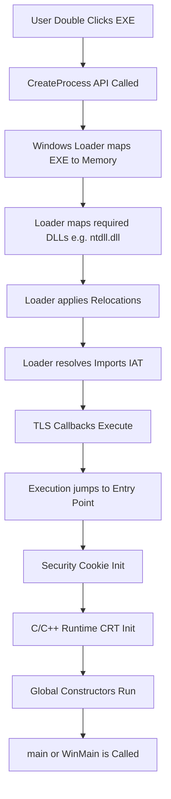

# 3. The Loading Process

What actually happens when you double-click `example.exe`? It doesn't just magically jump to `main()`. A complex sequence of events, managed by the OS and the executable itself, sets the stage.

Understanding this timeline is crucial because malware and anti-debugging tricks often hide in the early stages of this process, hoping analysts only look at `main()`.

## The Startup Timeline

Here is a simplified step-by-step timeline of an executable's birth:

### 1. CreateProcess
When a user launches an app, the shell (e.g., Explorer) calls `CreateProcess` (or a variant). The OS creates a new virtual address space (a sandbox) for the process.

### 2. The Windows Loader (`ntdll.dll`)
The actual magic of loading the PE file is handled by a component called the Loader, which resides mostly in `ntdll.dll`.
*   **Mapping:** It reads the PE headers and maps the sections (`.text`, `.data`, etc.) into the new process's memory according to their RVAs.
*   **Loading Dependencies:** It looks at the Import Table. If the EXE needs `user32.dll`, the Loader finds `user32.dll` on disk and maps *it* into the process's memory too.

### 3. Fixing Up Memory (Relocations & Imports)
*   **Relocations:** If the EXE or DLL couldn't be loaded at its preferred `ImageBase`, the Loader walks the `.reloc` section and updates all hardcoded memory addresses.
*   **Resolving Imports:** The Loader finds the actual memory addresses of the imported functions (like `MessageBoxA`) inside the loaded DLLs, and writes those addresses into the EXE's Import Address Table (IAT).

### 4. TLS Callbacks (The Ninja Stage)
If the executable has a `.tls` section with Thread Local Storage callbacks defined, the OS calls these functions *before* the main thread actually starts running the executable's entry point.
*   **Reverse Engineering Note:** Always check for TLS callbacks in unknown binaries. If you just set a breakpoint on the Entry Point, a malicious TLS callback might have already run and detected your debugger!

### 5. Transition to User Entry Point
The Loader has finished its job. It transfers execution to the address specified in the `AddressOfEntryPoint` field of the PE header.

**Wait, is this `main()`?**
No! The entry point is almost never `main()`. It is a compiler-generated startup function (often called something like `mainCRTStartup` or `start`).

### 6. CRT Initialization
The C/C++ Runtime (CRT) startup code takes over. It has several jobs:
*   **Security Cookie Setup:** Generates a random value used to protect against stack buffer overflows (Stack Canaries).
*   **Environment Setup:** Retrieves command-line arguments and environment variables.
*   **Global Constructors:** If you have global C++ objects (e.g., `std::string g_name = "hello";`), their constructors must run before `main()`. The CRT handles this.

### 7. Finally, `main()`
Once the environment is perfectly set up, the CRT calls your `main()` (or `WinMain()` for GUI apps) function.

---

## Challenges and Tasks

### Task 1: Locating the True Entry Point
1. Open `challenges/ch03_task.exe` in Ghidra.
2. Let auto-analysis finish. Look at the Imports tree and note `wininet.dll`.
3. Find the Entry Point and see the compiler-generated boilerplate.

### Challenge 1: TLS Callback Hunting
1. Open `challenges/ch03_chal.exe` in Ghidra or a PE editor.
2. Check the "Data Directories" in the Optional Header. Look for the "TLS Table" entry.
3. Run the binary in a normal terminal. Notice that it prints "I ran before main!" before "I am main!".
